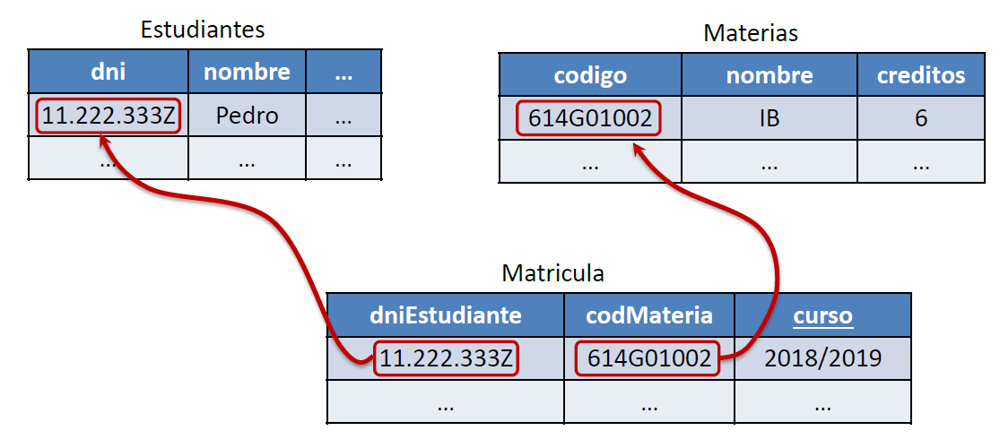
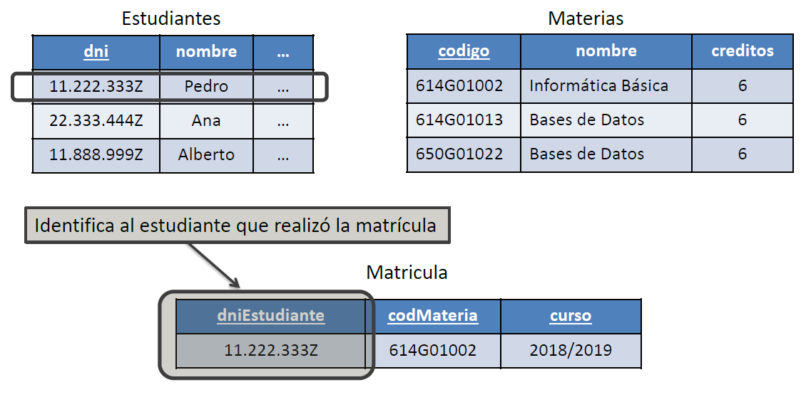
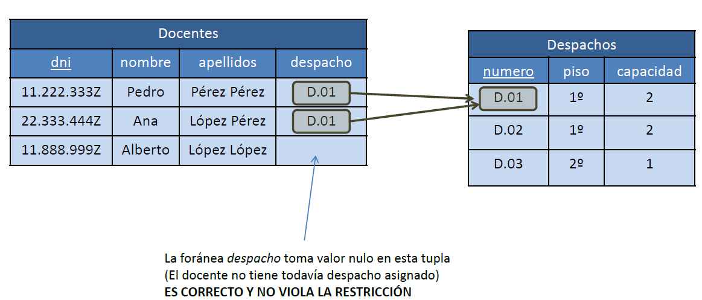

Introducción al lenguaje SQL
============================


Los sistemas de información gestionan repositorios de información en múltiples formatos, 
siendo el más popular las bases de datos relacionales a las que se accede mediante SQL (Structured Query Language).

El ejemplo que trabajaremos en este capítulo está disponible en Kaggle: [www.kaggle.com/gltaboada/sqlite-tutorial-in-r](https://www.kaggle.com/gltaboada/sqlite-tutorial-in-r)

## Bases de Datos Relacionales

### Definiciones

* **Dominio**: contexto (organización, empresa, evento...) objeto de gestión de la información.

* **Dato**: hecho con significado implícito, registable, relevante en un determinado dominio.

* **Base de datos**: colección de datos de un determinado dominio relacionados entre sí, organizados de forma que sea posible manipularlos y recuperarlos de forma eficiente.

* Sistema de Gestión de Bases de Datos (**SGBD**) (en inglés **RDBMS**, Relational Database Management System): software que permite a los usuarios crear y manipular bases de datos mediante operaciones CRUD:
	+ Crear / Insertar Datos (Create)
	+ Consultar / Leer (Read)
	+ Actualizar / Modificar (Update)
	+ Eliminar (Delete)

***

* **Modelo de datos**: abstracción conceptual que propone una manera de organizar y manipular los datos. Definido mediante:
	+ Estructura: elementos para organizar datos
	+ Integridad: reglas para relaciones los elementos
	+ Manipulación: operaciones sobre los datos adaptadas a la estructura y reglas

* Modelo de datos conceptual **Entidad Relación** (entidades, relaciones, atributos)

* Modelo de datos lógico o de representación (**modelo relacional** de Codd)
	+ Datos en relaciones (tablas)
	+ Base matemática formal
	+ Flexible

* Modelo de datos físico (tal y como se almacenan los datos)

Una fila de la tabla (relación) es una tupla y una columna un atributo (ver Figura \@ref(fig:relacion)). 

(ver Figura \@ref(fig:relacion))

(ver Figura \@ref(fig:relacion))


\begin{figure}[!htb]

{\centering \includegraphics[width=0.7\linewidth]{images/Relacion} 

}

\caption{Esquema de una relación.}(\#fig:relacion)
\end{figure}

Una base de datos es un conjunto de tablas (al menos una).

{width=600px}

La tabla no es una relación porque la relación es un conjunto sin orden y una tabla puede tener filas repetidas y tiene orden.

***

* **Esquema**: estructura de la base de datos

* **Estado**: contenido de la base de datos

* Restricción de **integridad**: regla que debe cumplir la información registrada en la base de datos para garantizar la integridad de la información.

Cualquier Base de Datos basada en el modelo relacional ha de cumplir como mínimo estas restricciones (además de las propias del dominio):

* Restricción de dominio: el valor de cada atributo debe de ser único (teléfono, no valor único), no descomponible (nombre completo descomponible en nombre y apellidos, domicilio en calle, CP, localidad, etc...)

* Una relación es un conjunto de tuplas, por tanto todas las tuplas son distintas.

* Una **superclave** es un subconjunto de atributos tal que no existen dos tuplas con la misma superclave. 

> Ejercicio. En la relación Empleado(dni, nombre, apellidos, email) ¿cuántas superclaves existen?

* Una **clave candidata** es una superclave mínima (superclave mínima es la clave a la que no se le puede eliminar un atributo). 

> ¿Cuántas claves candidatas hay en el ejemplo anterior?

* **Clave primaria** es la clave candidata que elegimos que identificar de forma unívoca las tuplas de una relación. Restricción de integridad de entidad: Ningún valor de la clave primaria puede ser un valor nulo.

* **Clave foránea** es un conjunto de atributos de una relación R_1 que, para cada tupla, identifican a otra tupla de una relación R_2 con la que está relacionada. 
La Restricción de integridad referencial nos dice que la clave foránea ha de corresponderse con la clave primaria de R_2, y si la clave foránea no es nula ha de refir a una tupla en R_2.

{width=600px}

{width=600px}

Si borramos/actualizamos un valor de clave foránea podemos: (a) prohibir el cambio, o (b) poner a nulo la clave foránea (borrado) o propagar el cambio (modificación).

***

* Ventajas de SGBD:
	+ Administración centralizada de los datos (por un administrador en un servidor/plataforma central que evita la información en silos -redundante/inconsistente)
	+ Desacoplado del almacenamiento físico de los datos (no es necesario conocerlo)
	+ Simplicidad de acceso (ODBC + SQL, lenguaje declarativo)
	+ Control de integridad (restricciones genéricas, integridad de entidad y referencial, de dominio, y las del dominio en software)
	+ Control de acceso concurrente (evita inconsistencia)
	+ Seguridad (autenticación, roles de acceso)
	+ Recuperación ante fallos (backup, logs y transacciones -rollback-)


## Sintaxis SQL

A continuación 27 clásulas SQL básicas

### Extracción SQL (11 statements)


```r
SELECT column1, column2....columnN
FROM   table_name;

SELECT DISTINCT column1, column2....columnN
FROM   table_name;

SELECT column1, column2....columnN
FROM   table_name
WHERE  CONDITION;

SELECT column1, column2....columnN
FROM   table_name
WHERE  CONDITION-1 {AND|OR} CONDITION-2;

SELECT column1, column2....columnN
FROM   table_name
WHERE  column_name IN (val-1, val-2,...val-N);

SELECT column1, column2....columnN
FROM   table_name
WHERE  column_name BETWEEN val-1 AND val-2;

SELECT column1, column2....columnN
FROM   table_name
WHERE  column_name LIKE { PATTERN };

SELECT column1, column2....columnN
FROM   table_name
WHERE  CONDITION
ORDER BY column_name {ASC|DESC};

SELECT SUM(column_name)
FROM   table_name
WHERE  CONDITION
GROUP BY column_name;

SELECT COUNT(column_name)
FROM   table_name
WHERE  CONDITION;

SELECT SUM(column_name)
FROM   table_name
WHERE  CONDITION
GROUP BY column_name
HAVING (arithematic function condition);
```

### Crear/Actualizar/Borrar tablas SQL (8 statements)


```r
CREATE TABLE table_name(
column1 datatype,
column2 datatype,
column3 datatype,
.....
columnN datatype,
PRIMARY KEY( one or more columns )
);

DROP TABLE table_name;

CREATE UNIQUE INDEX index_name
ON table_name ( column1, column2,...columnN);

ALTER TABLE table_name
DROP INDEX index_name;

DESC table_name;

TRUNCATE TABLE table_name;

ALTER TABLE table_name {ADD|DROP|MODIFY} column_name {data_ype};

ALTER TABLE table_name RENAME TO new_table_name;
```

### Añadir/Actualizar/Borrar tuplas en SQL (3 statements)


```r
INSERT INTO table_name( column1, column2....columnN)
VALUES ( value1, value2....valueN);

UPDATE table_name
SET column1 = value1, column2 = value2....columnN=valueN
[ WHERE  CONDITION ];

DELETE FROM table_name
WHERE  {CONDITION};
```

### Gestión Bases de Datos (5 statements)


```r
CREATE DATABASE database_name;

DROP DATABASE database_name;

USE database_name;

COMMIT;

ROLLBACK;
```


### Ejemplos de consultas SQL


```r
SELECT Nombre, Apellido1, Apellido2, Municipio, Provincia 
FROM Cliente
WHERE Municipio = 'Lugo'
ORDER BY Apellido1

INSERT Proveedor(Nombre, PersonaContacto, Ciudad, País)
VALUES ('Café Candelas', 'Ivana Candelas', 'Lugo', 'España')

UPDATE Pedidos
SET Cantidad = 2
WHERE IdProducto = 963

DELETE Cliente
WHERE Email = 'alexandregb@gmail.com'
```


## Conexión con bases de datos desde R 

### Introducción a SQL en R

SQL se usa para manipular datos dentro de una base de datos. Si la base de datos no es muy grande se puede cargar toda en un data.frame. 
No obstante, por escalabilidad y offloading de la carga de trabajo al servidor SGBD utilizaremos SQL.

Existen varios SGBD (SQLite, Microsoft SQL Server, MySQL, PostgreSQL, etc) los cuales comparten el soporte de SQL (en concreto ANSI SQL) aunque cada gestor extiende SQL 
de formas sutiles buscando minar cierta portabilidad de código (*vendor-locking*). En efecto, un código SQL desarrollado para SQLite es probable que falle con MySQL 
aunque tras aplicar ligeras modificaciones ya funcionará. Asimismo el mecanismo de conexión, configuración, rendimiento y operación suele diferir entre SGBD.

A continuación se lista una serie de paquetes utilizados en el acceso a los datos, lo que suele ser el principal esfuerzo a realizar cuando se trabaja con SGBD:

- [DBI](https://cran.r-project.org/web/packages/DBI/index.html)
- [RODBC](https://cran.r-project.org/web/packages/RODBC/index.html)
- [dbConnect](https://cran.r-project.org/web/packages/dbConnect/index.html)
- [RSQLite](https://cran.r-project.org/web/packages/RSQLite/index.html)
- [RMySQL](https://cran.r-project.org/web/packages/RMySQL/index.html)
- [RPostgreSQL](https://cran.r-project.org/web/packages/RPostgreSQL/index.html)

### El paquete sqldf

A continuación se presenta una serie de ejercicios con la sintaxis de SQL operando sobre un data.frame con el paquete sqldf. Esto inicialmente no incluye los detalles de conectarse a un SGBD, ni modificar los
datos, solamente el uso de SQL para extraer datos con el objetivo de ser analizados en R. 


```r
library(sqldf)
```


```r
sqldf('SELECT age, circumference FROM Orange WHERE Tree = 1 ORDER BY circumference ASC')
```

```
##    age circumference
## 1  118            30
## 2  484            58
## 3  664            87
## 4 1004           115
## 5 1231           120
## 6 1372           142
## 7 1582           145
```

### SQL Queries

El comando inicial es SELECT. SQL no es case-sensitive, por lo que esto va a funcionar:


```r
sqldf("SELECT * FROM iris")
sqldf("select * from iris")
```

pero lo siguiente no va a funcionar (a menos que tengamos un objeto IRIS:


```r
sqldf("SELECT * FROM IRIS")
```

La sintaxis básica de SELECT es:


```r
SELECT variable1, variable2 FROM data
```

#### Asterisco/Wildcard

Lo extrae todo


```r
bod2 <- sqldf('SELECT * FROM BOD')
```

#### Limit

Limita el número de resultados


```r
sqldf('SELECT * FROM iris LIMIT 5')
```

```
##   Sepal.Length Sepal.Width Petal.Length Petal.Width Species
## 1          5.1         3.5          1.4         0.2  setosa
## 2          4.9         3.0          1.4         0.2  setosa
## 3          4.7         3.2          1.3         0.2  setosa
## 4          4.6         3.1          1.5         0.2  setosa
## 5          5.0         3.6          1.4         0.2  setosa
```

#### Order By

Ordena las variables


```r
ORDER BY var1 {ASC/DESC}, var2 {ASC/DESC}
```


```r
sqldf("SELECT * FROM Orange ORDER BY age ASC, circumference DESC LIMIT 5")
```

```
##   Tree age circumference
## 1    2 118            33
## 2    4 118            32
## 3    1 118            30
## 4    3 118            30
## 5    5 118            30
```

#### Where

Sentencias condicionales, donde se puede incorporar operadores lógicos AND y OR, expresando el orden de evaluación con paréntesis en caso de ser necesario.


```r
sqldf('SELECT demand FROM BOD WHERE Time < 3')
```

```
##   demand
## 1    8.3
## 2   10.3
```


```r
sqldf('SELECT * FROM rock WHERE (peri > 5000 AND shape < .05) OR perm > 1000')
```

```
##   area     peri    shape perm
## 1 5048  941.543 0.328641 1300
## 2 1016  308.642 0.230081 1300
## 3 5605 1145.690 0.464125 1300
## 4 8793 2280.490 0.420477 1300
```

Y extendiendo su uso con IN o LIKE (es último sólo con %), pudiendo aplicárseles el NOT:


```r
sqldf('SELECT * FROM BOD WHERE Time IN (1,7)')
```

```
##   Time demand
## 1    1    8.3
## 2    7   19.8
```


```r
sqldf('SELECT * FROM BOD WHERE Time NOT IN (1,7)')
```

```
##   Time demand
## 1    2   10.3
## 2    3   19.0
## 3    4   16.0
## 4    5   15.6
```


```r
sqldf('SELECT * FROM chickwts WHERE feed LIKE "%bean" LIMIT 5')
```

```
##   weight      feed
## 1    179 horsebean
## 2    160 horsebean
## 3    136 horsebean
## 4    227 horsebean
## 5    217 horsebean
```


```r
sqldf('SELECT * FROM chickwts WHERE feed NOT LIKE "%bean" LIMIT 5')
```

```
##   weight    feed
## 1    309 linseed
## 2    229 linseed
## 3    181 linseed
## 4    141 linseed
## 5    260 linseed
```


## Ejemplo Scopus data

Ver ejemplo [*citan.zip*](data/citan.zip) y Apéndice \@ref(citan).

> “If your data fits in memory 
  there is no advantage to putting it in a database: 
  it will only be slower and more frustrating”
>
> --- Hadley Wickham – https://dbplyr.tidyverse.org/articles/dbplyr.html


## Ejercicios SQL con RSQLite

### Setup de RSQLite

Vamos a utilizar [RSQLite](https://cran.r-project.org/web/packages/RSQLite/index.html) desde Kaggle. Pero si lo queréis instalar en local La información para su instalación está [en el siguiente enlace](https://db.rstudio.com/databases/sqlite/).


```r
library(DBI)

# Create an ephemeral in-memory RSQLite database
con <- dbConnect(RSQLite::SQLite(), ":memory:")
dbListTables(con)
```

```
## character(0)
```


```r
dbWriteTable(con, "mtcars", mtcars)
dbListTables(con)
```

```
## [1] "mtcars"
```

```r
dbListFields(con, "mtcars")
```

```
##  [1] "mpg"  "cyl"  "disp" "hp"   "drat" "wt"   "qsec" "vs"   "am"   "gear"
## [11] "carb"
```

```r
dbReadTable(con, "mtcars")
```

```
##     mpg cyl  disp  hp drat    wt  qsec vs am gear carb
## 1  21.0   6 160.0 110 3.90 2.620 16.46  0  1    4    4
## 2  21.0   6 160.0 110 3.90 2.875 17.02  0  1    4    4
## 3  22.8   4 108.0  93 3.85 2.320 18.61  1  1    4    1
## 4  21.4   6 258.0 110 3.08 3.215 19.44  1  0    3    1
## 5  18.7   8 360.0 175 3.15 3.440 17.02  0  0    3    2
## 6  18.1   6 225.0 105 2.76 3.460 20.22  1  0    3    1
## 7  14.3   8 360.0 245 3.21 3.570 15.84  0  0    3    4
## 8  24.4   4 146.7  62 3.69 3.190 20.00  1  0    4    2
## 9  22.8   4 140.8  95 3.92 3.150 22.90  1  0    4    2
## 10 19.2   6 167.6 123 3.92 3.440 18.30  1  0    4    4
## 11 17.8   6 167.6 123 3.92 3.440 18.90  1  0    4    4
## 12 16.4   8 275.8 180 3.07 4.070 17.40  0  0    3    3
## 13 17.3   8 275.8 180 3.07 3.730 17.60  0  0    3    3
## 14 15.2   8 275.8 180 3.07 3.780 18.00  0  0    3    3
## 15 10.4   8 472.0 205 2.93 5.250 17.98  0  0    3    4
## 16 10.4   8 460.0 215 3.00 5.424 17.82  0  0    3    4
## 17 14.7   8 440.0 230 3.23 5.345 17.42  0  0    3    4
## 18 32.4   4  78.7  66 4.08 2.200 19.47  1  1    4    1
## 19 30.4   4  75.7  52 4.93 1.615 18.52  1  1    4    2
## 20 33.9   4  71.1  65 4.22 1.835 19.90  1  1    4    1
## 21 21.5   4 120.1  97 3.70 2.465 20.01  1  0    3    1
## 22 15.5   8 318.0 150 2.76 3.520 16.87  0  0    3    2
## 23 15.2   8 304.0 150 3.15 3.435 17.30  0  0    3    2
## 24 13.3   8 350.0 245 3.73 3.840 15.41  0  0    3    4
## 25 19.2   8 400.0 175 3.08 3.845 17.05  0  0    3    2
## 26 27.3   4  79.0  66 4.08 1.935 18.90  1  1    4    1
## 27 26.0   4 120.3  91 4.43 2.140 16.70  0  1    5    2
## 28 30.4   4  95.1 113 3.77 1.513 16.90  1  1    5    2
## 29 15.8   8 351.0 264 4.22 3.170 14.50  0  1    5    4
## 30 19.7   6 145.0 175 3.62 2.770 15.50  0  1    5    6
## 31 15.0   8 301.0 335 3.54 3.570 14.60  0  1    5    8
## 32 21.4   4 121.0 109 4.11 2.780 18.60  1  1    4    2
```

```r
# You can fetch all results:
res <- dbSendQuery(con, "SELECT * FROM mtcars WHERE cyl = 4")
dbFetch(res)
```

```
##     mpg cyl  disp  hp drat    wt  qsec vs am gear carb
## 1  22.8   4 108.0  93 3.85 2.320 18.61  1  1    4    1
## 2  24.4   4 146.7  62 3.69 3.190 20.00  1  0    4    2
## 3  22.8   4 140.8  95 3.92 3.150 22.90  1  0    4    2
## 4  32.4   4  78.7  66 4.08 2.200 19.47  1  1    4    1
## 5  30.4   4  75.7  52 4.93 1.615 18.52  1  1    4    2
## 6  33.9   4  71.1  65 4.22 1.835 19.90  1  1    4    1
## 7  21.5   4 120.1  97 3.70 2.465 20.01  1  0    3    1
## 8  27.3   4  79.0  66 4.08 1.935 18.90  1  1    4    1
## 9  26.0   4 120.3  91 4.43 2.140 16.70  0  1    5    2
## 10 30.4   4  95.1 113 3.77 1.513 16.90  1  1    5    2
## 11 21.4   4 121.0 109 4.11 2.780 18.60  1  1    4    2
```

```r
dbClearResult(res)

# Or a chunk at a time
res <- dbSendQuery(con, "SELECT * FROM mtcars WHERE cyl = 4")
while(!dbHasCompleted(res)){
  chunk <- dbFetch(res, n = 5)
  print(nrow(chunk))
}
```

```
## [1] 5
## [1] 5
## [1] 1
```

```r
# Clear the result
dbClearResult(res)

# Disconnect from the database
dbDisconnect(con)
```


## Práctica 1: SQL

Vamos a utilizar la base de datos [Chinook](https://www.sqlitetutorial.net/wp-content/uploads/2018/03/chinook.zip) del [tutorial de SQLite](https://www.sqlitetutorial.net/sqlite-sample-database/)

{width=600px}

Los ejercicios pedidos en Kaggle [kaggle.com/gltaboada/sqlite-tutorial-in-r](https://www.kaggle.com/gltaboada/sqlite-tutorial-in-r) se entregarán preferentemente antes del **14/10** compartiendo un notebook con las soluciones (¡notebooke privado!) con el usuario **gltaboada**. Antes me tenéis que enviar un email comunicando qué usuario tenéis cada uno. En caso de incidencia me podéis mandar un notebook descargado (.ipynb), o el mecanismo que hayamos acordado previamente. 


<!-- Exercises 19-20
### Ejercicios de Análisis Exploratorio

La puntuación de esta práctica será -3 más el número de respuestas correctas (puntuación máxima 10). Se valorará especialmente encontrar la solución más sencilla en una única query SQL. 

1. Conocer el importe mínimo, máximo y la media de las facturas.

2. Conocer el total de las facturas de cada uno de los países.

3. Obtener el listado de países junto con su facturación media, ordenado (a) alfabéticamente por país y (b) decrecientemente por importe de facturación media

4. Obtener un listado con Nombre y Apellidos de cliente y el importe de cada una de sus facturas (Hint: WHERE customer.CustomerID=invoices.CustomerID)

5. ¿Qué porcentaje de las canciones son video?

6. Listar los 10 mejores clientes (aquellos a los que se les ha facturado más cantidad) indicando Nombre, Apellidos, Pais y el importe total de su facturación.

7. Listar los géneros musicales por orden decreciente de popularidad (definida la popularidad como el número de canciones de ese género), indicando el porcentaje de las canciones de ese género.

8. Listar los 10 artistas con mayor número de canciones de forma descendente según el número de canciones.

9. Listar Nombre y Apellidos de los "Sales Support Agent" así como la facturación de los clientes que tienen asignados, además de mostrar el porcentaje de la facturación total y del número total de empleados. 

10. Listar los géneros musicales que más importe facturan y el porcentaje de su facturación.

11. Listas los géneros musicales ordenados de forma decreciente según el número de canciones por las que no están facturando.

12. Conocer la facturación de los clientes agrupados por su servidor de correo electrónico (e.g., la facturación de los clientes de gmail.com, los de hotmail.com, por orden decreciente de facturación).

13. Ordenar las playlists por la facturación obtenida por sus canciones.
-->


