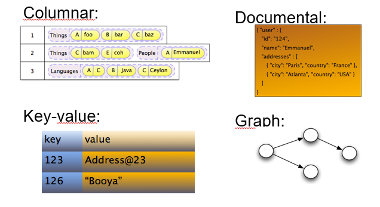
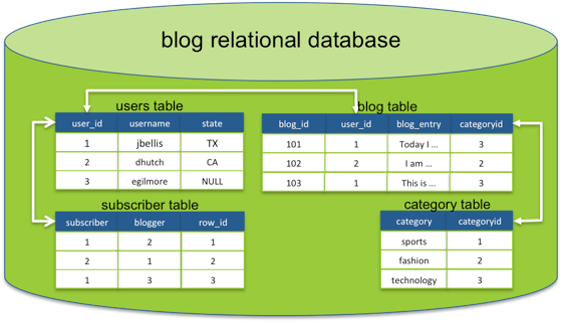

Introducción a Tecnologías NoSQL
================================

Son tecnologías de almacenamiento de datos en servicios web altamente escalables.


## Conceptos y tipos de bases de datos NoSQL (documental, columnar, clave/valor y de grafos)

NoSQL - “Not Only SQL” - es una nueva categoría de bases de datos no-relacionales y altamente distribuidas.

Las bases de datos NoSQL nacen de la necesidad de:

- Simplicidad en los diseños

- Escalado horizontal

- Mayor control en la disponibilidad

Pero cuidado, en muchos escenarios las BBDD relacionales siguen siendo la mejor opción.

### Características de las bases de datos NoSQL

* Libre de esquemas – no se diseñan las tablas y relaciones por adelantado, además de permitir la migración del esquema.
* Proporcionan replicación a través de escalado horizontal.
* Este escalado horizontal se traduce en arquitectura distribuida
* Generalmente ofrecen consistencia débil
* Hacen uso de estructuras de datos sencillas, normalmente pares clave/valor a bajo nivel
* Suelen tener un sistema de consultas propio (o SQL-like)
* Siguen el modelo BASE (*B*asic Availability, Soft state, Eventual consistency) en lugar de ACID (*A*tomicity, *C*onsistency, *I*solation, *D*urability)

El modelo BASE consiste en:

* Basic Availability – el sistema garantiza disponibilidad, en términos del teorema CAP.
* Soft state – el estado del sistema puede cambiar a lo largo del tiempo, incluso sin entrada. Esto es provocado por el modelo de consistencia eventual.
* Eventual consistency – el sistema alcanzará un estado consistente con el tiempo, siempre y cuando no reciba entrada durante ese tiempo.


#### Teorema CAP

Es imposible para un sistema de cómputo distribuido garantizar simultáneamente:

* Consistency – Todos los nodos ven los mismos datos al mismo tiempo
* Availability – Toda petición obtiene una respuesta en caso tanto de éxito como fallo
* Partition Tolerance – El sistema seguirá funcionando ante pérdidas arbitrarias de información o fallos parciales 


Las razones para escoger NoSQL son:

* Analítica
 + Gran cantidad de escrituras, análisis en bloque 
* Escalabilidad
 + Tan fácil como añadir un nuevo nodo a la red, bajo coste.
* Redundancia
 + Están diseñadas teniendo en cuenta la redundancia
* Rápido desarrollo
 + Al ser schema-less o schema on-read son más flexibles que schema on-write
* Flexibilidad en el almacenamiento de datos
 + Almacenan todo tipo de datos: texto, imágenes, BLOBs
 + Gran rendimiento en consultas sobre datos que no implican relaciones jerárquicas
 + Gran rendimiento sobre BBDD desnormalizadas
* Tamaño
 + El tamaño del esquema de datos es demasiado grande
 + Muchos datos temporales fuera de almacén principal

Razones para NO escoger NoSQL:
* Consistencia y Disponibilidad de los datos son críticas
* Relaciones entre datos son importantes 
 + E.g. joins numerosos y/o importantes
* En general, cuando el modelo ACID encaja mejor

### Tipos de Bases de Datos NoSQL





### MongoDB: NoSQL documental


### Redis: NoSQL key-value

In-memory data structure store, útil para base de datos de login-password, sensor-valor, URL-respuesta, con una sintaxis muy sencilla:

* El comando SET almacena valores
 + SET server:name “luna”
* Recuperamos esos valores con GET
 + GET server:name
* INCR incrementa atómicamente un valor
 + INCR clients
* DEL elimina claves y sus valores asociados
 + DEL clients
* TTL (Time To Live) útil para cachés
 + EXPIRE promocion 60

### Cassandra: NoSQL columnar




### Neo4j: NoSQL grafos


### Otros: search engines

Son sistemas especializados en búsquedas, procesamiento de lenguaje natural como ElasticSearch, Solr, Splunk (logs de aplicaciones), etc...


## Conexión de R a MongoDB

A través del paquete [mongolite](https://cran.rstudio.com/web/packages/mongolite/mongolite.pdf), aquí tenéis un [Tutorial](https://datascienceplus.com/using-mongodb-with-r/)


``` r
install.packages("mongolite")
```


``` r
library(mongolite)

# Connect to a local MongoDB

my_collection = mongo(collection = "restaurants", db = "Restaurants") # create connection, database and collection
my_collection$count
```


## Ejercicios prácticos con MongoDB

Estos ejercicios se pueden hacer en un notebook Kaggle accediendo a un clúster de MongoDB en el [cloud de MongoDB](https://cloud.mongodb.com). Se carga la base de datos de ejemplo y se puede hacer con la colección de restaurantes (o alternativamente con otras colleciones).

1. Mostrar todos los documentos de la colección restaurants (u otra)

2. Mostrar nombre de restaurante, barrio y cocina de la colección restaurants (o los campos de otra colección)

3. Mostrar los primeros 5 restaurantes del barrio Bronx.

4. Mostrar los restaurantes con una longitud menor que -75.7541

5. Mostrar los restaurantes con una puntuación superior a 90

6. Mostrar los restaurantes de comida American o Chineese del barrio Queens.

7. Mostrar los restaurantes con un grado "A" y puntuación 9 obtenida en fecha 2014-08-11T00:00:00Z

8. Propón un JSON para descargar (de algún repositorio OpenData o disponible en un API), indícame la URL, si has de hacer algún proceso antes de importarlo en MongoDB, cómo lo importas, dame un pantallazo del análisis exploratorio de ese JSON y una query que harías contra ese JSON (la query en MongoDB, Compass o RmongoDB)


