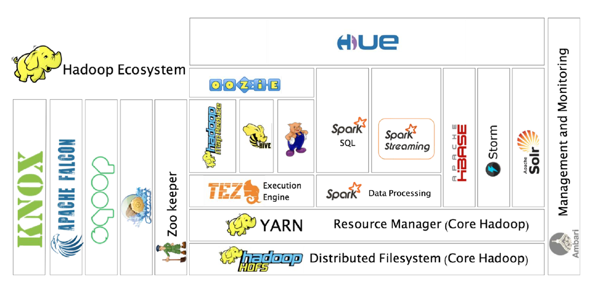
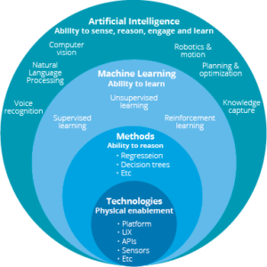
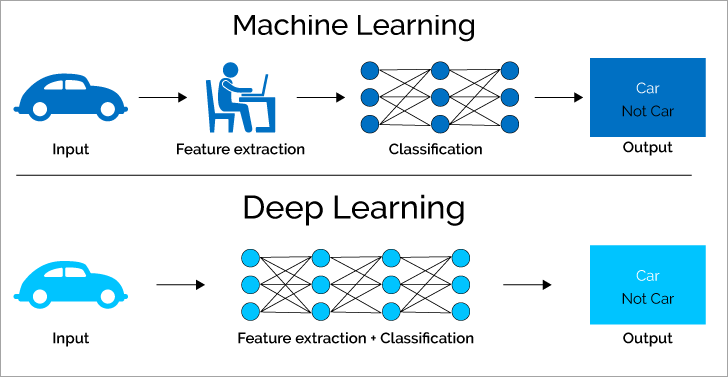
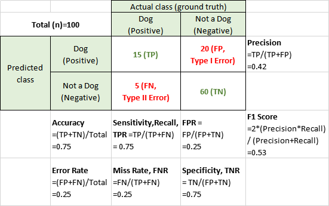
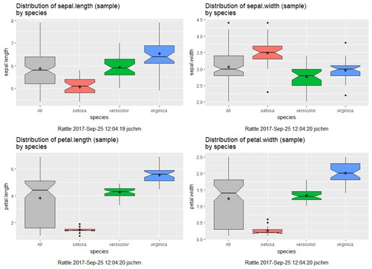
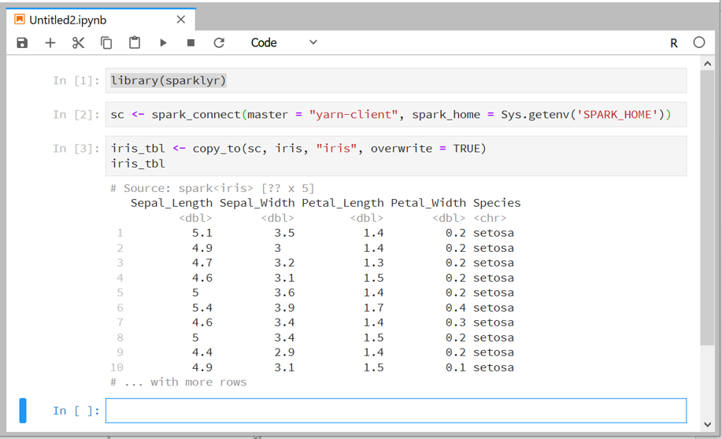

Tecnologías para el Tratamiendo de Datos Masivos
================================================

En este apartado trataremos los siguientes epígrafes:

1. Introducción al Aprendizaje Estadístico

2. Tecnologías Big Data (Hadoop, Spark, Sparklyr)

3. Ejercicios de análisis de datos masivos.


## Introducción al Aprendizaje Estadístico

El material para este apartado está disponible en el 
[Capítulo 1 del libro "Aprendizaje Estadístico"](
https://rubenfcasal.github.io/aprendizaje_estadistico/intro-AE.html) de Rubén Fernández Casal.  

Para seguir este capítulo es altamente recomendable tener instalado Rattle, para ello consultad el apéndice de instalación de R al final de este libro.

{width="60%"}


## Tecnologías Big Data (Hadoop/Spark y Visualización)

### Tecnologías Hadoop, Spark, y Sparklyr

A continuación se introducen los conceptos básicos de las tecnologías Hadoop, Spark y Sparklyr:

- Hadoop: framework open-source desarrollado en Java principalmente que soporta aplicaciones distribuidas sobre miles de nodos y a escala Petabyte. Está inspirado en el diseño de las operaciones de MapReduce de Google y el Google File System (GFS). Entre sus principales componentes destaca HDFS Hadoop Distributed File System, sistema de ficheros distribuido sobre múltiples nodos y accesible a nivel de aplicación. También destaca YARN como gestor de recursos, para ejecutar aplicaciones. Destacar que la versión original, Hadoop 1, estaba basada extensivamente en Map Reduce, Hadoop 2 colocó en su core a YARN y Hadoop 3 está orientado a la provisión de Plataforma como servicio y ejecución simultánea de múltiples cargas de trabajo distribuidas sobre recursos solicitados bajo demanda. 


- Hive: es un sistema de almancenamiento y explotación de datos del estilo de un data warehouse open source diseñado para ser ejecutado en entornos Hadoop. Permite agrupar, consultar y analizar datos almacenados en Hadoop File System y en Amazon S3 (almacenamiento de objetos en general) en esquema en estrella. Su lenguaje de consulta de datos, Hive Query Language o (HQL). 


- Spark: framework de computación distribuida open-source para el procesamiento de datos masivos sobre Hadoop con un paralelismo implícito sobre su estructura de datos (Resilient Distributed Dataset o RDD), permite operar en paralelo sobre una colección de datos sin saber en qué servidores están disponibles dichos datos y de una forma tolerante a fallos. Es uno de los principales frameworks de programación de entornos Hadoop al estar optimizado su procesamiento sobre memoria (en lugar de sobre archivos en disco) para obtener velocidad, tanto en sus vertientes Spark streaming y Spark SQL, como Spark Machile Learning MLlib. Dispone de interfaces en Java, Scala, Python y R, siendo las interfaces de R Rspark y Sparklyr.

- SparkR: es un paquete, el primero que apareció, para conectar R con Spark. Intenta ser lo más parecida a la interfaz estándard de R de manipulación de datos.

- Sparklyr: es una librería para conectar R con Spark posterior a SparkR. Intenta ser lo más parecida a dplyr y embeber SQL en las consultas, soportando una mayor cantidad de paquetes. Por este motivo es el proyecto más activo actualmente, sustituyendo a SparkR.




{width="60%"}


### Big Data y Machine Learning

El Machine Learning o Aprendizaje Máquina es aquella parte de la inteligencia artificial con capacidad de aprender de los datos. 

{width="70%"}




Y un ejemplo de cómo se trabaja en machine learning:

{width="70%"}

<!--

https://medium.com/analytics-vidhya/iris-species-using-auto-ml-pycaret-327985fb362f
http://www.lac.inpe.br/~rafael.santos/Docs/CAP394/WholeStory-Iris.html
https://sebastianraschka.com/faq/docs/clf-behavior-data.html
https://pythonmachinelearning.pro/supervised-learning-using-decision-trees-to-classify-data/

-->

{width="70%"}


### Rattle como alternativa a RapidMiner en R


Las instrucciones para instalar R está en el [Apéndice 3 de este documento](https://gltaboada.github.io/tgdbook/instalaci%C3%B3n-de-r.html)

Un tutorial adecuado para introducirse en Rattle es [éste](https://www.dummies.com/programming/using-rattle-iris-r-programming/)
 


Con el tutorial se pueden ver las capacidades de rattle de explorar los datos, como se puede apreciar a continuación.




### Visualización y Generación de Cuadros de Mando

Se sigue un tutorial de la herramienta [PowerBI, con datos de Excel y OData Feed](https://docs.microsoft.com/es-es/power-bi/desktop-tutorial-analyzing-sales-data-from-excel-and-an-odata-feed)

Como documentación de se soporte se cuenta con la web de [PowerBI](https://docs.microsoft.com/es-es/power-bi/) y [un tutorial adicional](https://ccance.net/manuales/powerbi/capitulo_01_introduccion.pdf)


## Introducción al Análisis de Datos Masivos

En primer lugar se ha de considerar explorar los datos y realizar minería con ellos, y eso es posible hacerlo vía sparklyr. 

Este apartado, eminentemente práctico, lo trabajaremos a través de [la práctica 3 de TGD](https://www.kaggle.com/gltaboada/t3-practice3-flights).


<!--


## Práctica 3: Big Data


Los ejercicios se entregarán por correo electrónico a guillermo.lopez.taboada@udc.es en formato PDF o R MarkDown con el nombre de archivo P3X-Apellidos-Nombre.Rmd (sin tildes ni caracteres especiales en el nombre del arhivo) **antes** del miércoles 18 de Diciembre.

### Ejercicio A con sparklyr


(3 puntos) Replicación del siguiente ejercicio con sparklyr y el dataset iris (https://spark.rstudio.com/mlib/) en modo local o modo YARN. Puede ser dentro de jupyterlab (así me entregáis archivo “Apellidos-Nombre.ipynb”) o en R remoto o en Rstudio (vía Desktop de visualización) (en estos dos últimos casos entregáis P3A-Apellidos-Nombre.R).

### Ejercicio B con rattle

(4 puntos) Informe (en PDF) sobre uno de los 4 datasets (audit, weather, weatherAUS, wine) que se describen a continuación   https://cran.r-project.org/web/packages/rattle.data/rattle.data.pdf
Se busca que realicéis un análisis con Rattle, mínimo con las pestañas Explore, Cluster y Model.

### Ejercicio C con sparklyr y Hadoop

(3 puntos) Replicación del siguiente ejercicio con sparklyr en el CESGA, en análisis de los datos del dataset de vuelos:
http://hua-zhou.github.io/teaching/biostatm280-2019winter/slides/16-sparklyr/sparklyr-flights.html  
se valorarán análisis adicionales y detalles sobre tiempos de ejecución de los análisis, espera en colas yarn, listado de trabajos spark, etc… 


### Combinando los distintos elementos

Vamos a seguir [un tutorial de análisis de datos de vuelos](http://hua-zhou.github.io/teaching/biostatm280-2019winter/slides/16-sparklyr/sparklyr-intro.html), adaptándolo al entorno del CESGA. 

En primer lugar, tras conectarnos por ssh al CESGA, y en el mismo directorio en que hemos hecho la conexión, nos descargamos los datos:


```r
# Make download directory
mkdir flights

# Download flight data by year
for i in {1987..2008}
  do
    echo "$(date) $i Download"
    fnam=$i.csv.bz2
    wget -O flights/$fnam http://stat-computing.org/dataexpo/2009/$fnam
    echo "$(date) $i Unzip"
    bunzip2 flights/$fnam
  done

# Download airline carrier data
wget -O airlines.csv http://www.transtats.bts.gov/Download_Lookup.asp?Lookup=L_UNIQUE_CARRIERS

# Download airports data
wget -O airports.csv https://raw.githubusercontent.com/jpatokal/openflights/master/data/airports.dat
```

Comprobamos que los datos están correctos:


```r
head flights/1987.csv 
head airlines.csv
head airports.csv
```

Y los copiamos al HDFS a través del comando fs de Hadoop:


```r
# Copy flight data to HDFS
hadoop fs -put flights 

# Copy airline data to HDFS
hadoop fs -mkdir airlines/
hadoop fs -put airlines.csv airlines

# Copy airport data to HDFS
hadoop fs -mkdir airports/
hadoop fs -put airports.csv airports
```


A continuación lanzamos la ejecución de 'hive':


```r
$ hive
```


Y creamos los metadatos que estructurarán la tabla de vuelos y cargamos los datos en la tabla Hive:


```r
# Create metadata for flights
CREATE EXTERNAL TABLE IF NOT EXISTS flights230
(
year int,
month int,
dayofmonth int,
dayofweek int,
deptime int,
crsdeptime int,
arrtime int, 
crsarrtime int,
uniquecarrier string,
flightnum int,
tailnum string, 
actualelapsedtime int,
crselapsedtime int,
airtime string,
arrdelay int,
depdelay int, 
origin string,
dest string,
distance int,
taxiin string,
taxiout string,
cancelled int,
cancellationcode string,
diverted int,
carrierdelay string,
weatherdelay string,
nasdelay string,
securitydelay string,
lateaircraftdelay string
)
ROW FORMAT DELIMITED
FIELDS TERMINATED BY ','
LINES TERMINATED BY '\n'
TBLPROPERTIES("skip.header.line.count"="1");

# Load data into table
LOAD DATA INPATH 'flights' INTO TABLE flights230;
```


Ídem para la tabla de aerolíneas, creamos los metadatos y cargamos los datos en la tabla HIVE:


```r
# Create metadata for airlines
CREATE EXTERNAL TABLE IF NOT EXISTS airlines
(
Code string,
Description string
)
ROW FORMAT SERDE 'org.apache.hadoop.hive.serde2.OpenCSVSerde'
WITH SERDEPROPERTIES
(
"separatorChar" = '\,',
"quoteChar"     = '\"'
)
STORED AS TEXTFILE
tblproperties("skip.header.line.count"="1");

# Load data into table
LOAD DATA INPATH 'airlines' INTO TABLE airlines;
```

Ídem para la tabla de aeropuertos, creamos los metadatos y cargamos los datos en la tabla HIVE:


```r
# Create metadata for airports
CREATE EXTERNAL TABLE IF NOT EXISTS airports
(
id string,
name string,
city string,
country string,
faa string,
icao string,
lat double,
lon double,
alt int,
tz_offset double,
dst string,
tz_name string
)
ROW FORMAT SERDE 'org.apache.hadoop.hive.serde2.OpenCSVSerde'
WITH SERDEPROPERTIES
(
"separatorChar" = '\,',
"quoteChar"     = '\"'
)
STORED AS TEXTFILE;

# Load data into table
LOAD DATA INPATH 'airports' INTO TABLE airports;
```


Nos conectamos a Spark (desde jupyter-lab o R): (alternativamente con 'sc <- spark_connect(master = "local")' )


```r
# Connect to Spark
library(sparklyr)
library(dplyr)
library(ggplot2)
sc <- spark_connect(master = "yarn-client", spark_home = Sys.getenv('SPARK_HOME')) 
sc
```


Si tenemos problemas para conectar podemos gestionar con YARN los recursos


```r
# Ver trabajos en YARN
yarn top

# Trabajos YARN en ejecución, en espera y aceptados
yarn application -list | grep RUNNING
yarn application -list | grep ACCEPTED
yarn application -list | grep SUBMITTED

# Cómo matar un trabajo YARN (si es de nuestro usuario). Indicar el ID de aplicación
yarn application -kill application_1575999528886_0161
```


Crear tablas dplyr a tablas HIVE: 


```r
# Cache flights Hive table into Spark
#tbl_cache(sc, 'flights')
flights_tbl <- tbl(sc, 'flights230')
flights_tbl %>% print(width = Inf)
```


```r
# Cache airlines Hive table into Spark
#tbl_cache(sc, 'airlines')
airlines_tbl <- tbl(sc, 'airlines')
airlines_tbl %>% print(width = Inf)
```


```r
# Cache airports Hive table into Spark
#tbl_cache(sc, 'airports')
airports_tbl <- tbl(sc, 'airports')
airports_tbl %>% print(width = Inf)
```


Ejemplos de análisis exploratorio de datos. Todos los vuelos por año:


```r
system.time({
out <- flights_tbl %>%
  group_by(year) %>%
  count() %>%
  arrange(year) %>%
  collect()
})
out
out %>% ggplot(aes(x = year, y = n)) + geom_col()
```


Vuelos con origen LAX (Los Angeles) por año:


```r
system.time({
out <- flights_tbl %>%
  filter(origin == "LAX") %>%
  group_by(year) %>%
  count() %>%
  arrange(year) %>%
  collect()
})
out
out %>% ggplot(aes(x = year, y = n)) + 
    geom_col() +
    labs(title = "Number of flights from LAX")
```

Y listado de países y número de aeropuertos:


```r
system.time({
out <- airports_tbl %>%
  group_by("country") %>%
  count()
})
out
```

Vamos a proceder a generar un conjunto de datos para calcular un modelo. Para ello buscaremos modelar como una regresión lineal la ganancia de un vuelo (gain) como (depdelay - arrdelay) basándose en la distancia, el retraso de la salida y la aerolínea usando datos del período 2003-2007:


```r
# Filter records and create target variable 'gain'
system.time(
  model_data <- flights_tbl %>%
    filter(!is.na(arrdelay) & !is.na(depdelay) & !is.na(distance)) %>%
    filter(depdelay > 15 & depdelay < 240) %>%
    filter(arrdelay > -60 & arrdelay < 360) %>%
    filter(year >= 2003 & year <= 2007) %>%
    left_join(airlines_tbl, by = c("uniquecarrier" = "code")) %>%
    mutate(gain = depdelay - arrdelay) %>%
    select(year, month, arrdelay, depdelay, distance, uniquecarrier, description, gain)
)
model_data
```


```r
# Summarize data by carrier
model_data %>%
  group_by(uniquecarrier) %>%
  summarize(description = min(description), gain = mean(gain), 
            distance = mean(distance), depdelay = mean(depdelay)) %>%
  select(description, gain, distance, depdelay) %>%
  arrange(gain)
```


Para entrenar la regresión lineal y predecir el tiempo ganado o perdido en un vuelo en función de la distancia, retraso en la salida y aerolínea procedemos de este modo:


```r
# Partition the data into training and validation sets
model_partition <- model_data %>% 
  sdf_partition(train = 0.8, valid = 0.2, seed = 5555)

# Fit a linear model
system.time(
  ml1 <- model_partition$train %>%
    ml_linear_regression(gain ~ distance + depdelay + uniquecarrier)
)

# Summarize the linear model
summary(ml1)
```

A continuación se compara la bondad del modelo con el subconjunto de validación


```r
# Calculate average gains by predicted decile
system.time(
  model_deciles <- lapply(model_partition, function(x) {
    ml_predict(ml1, x) %>%
      mutate(decile = ntile(desc(prediction), 10)) %>%
      group_by(decile) %>%
      summarize(gain = mean(gain)) %>%
      select(decile, gain) %>%
      collect()
  })
)
model_deciles

# Create a summary dataset for plotting
deciles <- rbind(
  data.frame(data = 'train', model_deciles$train),
  data.frame(data = 'valid', model_deciles$valid),
  make.row.names = FALSE
)
deciles

# Plot average gains by predicted decile
deciles %>%
  ggplot(aes(factor(decile), gain, fill = data)) +
  geom_bar(stat = 'identity', position = 'dodge') +
  labs(title = 'Average gain by predicted decile', x = 'Decile', y = 'Minutes')
```

Visualizar predicciones usando el año 2008 (no usado en el entrenamiento):


```r
# Select data from an out of time sample
data_2008 <- flights_tbl %>%
  filter(!is.na(arrdelay) & !is.na(depdelay) & !is.na(distance)) %>%
  filter(depdelay > 15 & depdelay < 240) %>%
  filter(arrdelay > -60 & arrdelay < 360) %>%
  filter(year == 2008) %>%
  left_join(airlines_tbl, by = c("uniquecarrier" = "code")) %>%
  mutate(gain = depdelay - arrdelay) %>%
  select(year, month, arrdelay, depdelay, distance, uniquecarrier, description, gain, origin, dest)
data_2008

# Summarize data by carrier
carrier <- ml_predict(ml1, data_2008) %>%
  group_by(description) %>%
  summarize(gain = mean(gain), prediction = mean(prediction), freq = n()) %>%
  filter(freq > 10000) %>%
  collect()
carrier

# Plot actual gains and predicted gains by airline carrier
ggplot(carrier, aes(gain, prediction)) + 
  geom_point(alpha = 0.75, color = 'red', shape = 3) +
  geom_abline(intercept = 0, slope = 1, alpha = 0.15, color = 'blue') +
  geom_text(aes(label = substr(description, 1, 20)), size = 3, alpha = 0.75, vjust = -1) +
  labs(title='Average Gains Forecast', x = 'Actual', y = 'Predicted')
```


Al terminar cualquier ejercicio con sparklyr desconectamos de Spark:


```r
spark_disconnect_all()
```


En este tema vamos a ver las tecnologías más relevantes para el tratamiento de datos masivos dentro de R, como son Spark (con sparklyr) dentro del ecosistema Hadoop. Los ejercicios prácticos se realizarán sobre la [plataforma Big Data](http://bigdata.cesga.es/) del [Centro de Supercomputación de Galicia (CESGA)](http://www.cesga.es)


Conexión vía SSH a CESGA (siempre con VPN activada!) y ejemplo #1:


```r
wget  https://packages.revolutionanalytics.com/datasets/claims2.csv 

# [3 minutos – 1GB/minuto en CESGA]  [recomendada la descarga desde servidor dtn.srv.cesga.es] [copia temp /tmp]

hadoop fs –mkdir p1/
hadoop fs -mkdir p1/claims/
hadoop fs –put claims2.csv p1/claims/   [3 segundos]
hadoop fs –ls p1/claims/

$ myquota
# [1TB en $HOMEBD y 18TB en Hadoop]

$ spark-shell --packages com.databricks:spark-csv_2.10:1.4.0
> val sqlContext = new org.apache.spark.sql.SQLContext(sc); 
> val df = sqlContext.read.format(csv).option(header, true).load(p1/claims/claims2.csv)
> df.count();  df.first();  df.take(5);  df.printSchema();
> df.registerTempTable(TblName)
> sqlContext.sql(select * from TblName limit 100).take(100).foreach(println)
> sqlContext.sql(select * from TblName where Calendar_year=2005).count()
```

Usando Spark-shell pero también podemos realizar ciertos análisis con hive:


```r
$ hadoop fs -mkdir bdp
$ hadoop fs -mkdir bdp/hv_csv_table
$ hadoop fs -mkdir bdp/hv_csv_table/ip
$ hadoop fs -put claims2.csv bdp/hv_csv_table/ip

$ hive      OR   $ beeline (recomendado este último por seguridad pero por simplicidad usamos hive en CESGA)

CREATE SCHEMA IF NOT EXISTS bdp;
CREATE EXTERNAL TABLE IF NOT EXISTS bdp.hv_csv_table (Row_ID STRING, Household_ID STRING, Vehicle STRING, Calendar_Year STRING, Model_Year STRING, Blind_Make STRING, Blind_Model STRING, Blind_Submodel STRING, Cat1 STRING, Cat2 STRING, Cat3 STRING, Cat4 STRING, Cat5 STRING, Cat6 STRING, Cat7 STRING, Cat8 STRING, Cat9 STRING, Cat10 STRING, Cat11 STRING, Cat12 STRING, OrdCat STRING, Var1 STRING, Var2 STRING, Var3 STRING, Var4 STRING, Var5 STRING, Var6 STRING, Var7 STRING, Var8 STRING, NVCat STRING, NVVar1 STRING, NVVar2 STRING, NVVar3 STRING, NVVar4 STRING, Claim_Amount STRING, veh_age STRING) ROW FORMAT DELIMITED FIELDS TERMINATED BY ',' STORED AS TEXTFILE LOCATION 'hdfs://nameservice1/user/cursoXXX/p1/claims/';

SELECT * FROM bdp.hv_csv_table LIMIT 10;
SELECT * FROM bdp.hv_csv_table where Calendar_Year=2005 limit 10;
SELECT * FROM bdp.hv_csv_table where Calendar_Year>2005;
```


Y ejemplo #2:
 

```r
# Generación de un archivo spanishTexts-ALL y 120-million-word-spanish-corpus.zip  
# Origen: https://www.kaggle.com/rtatman/120-million-word-spanish-corpus
hadoop fs –mkdir p2
hadoop fs -put 120-million-word-spanish-corpus.zip p2

$ spark-shell
# map
var map = sc.textFile(p2/spanishTest-ALL).flatMap(line => line.split( )).map(word => (word,1));
# reduce
var counts = map.reduceByKey(_ + _);
# save the output to file, every time a different directory!!!
counts.saveAsTextFile(p2/output)
counts.count() counts.first() counts.take(5)
# from word -> num to num -> word
# then sortBy num of occurrence in descending order 
val mostCommon = counts.map(p => (p._2, p._1)).sortByKey(false, 1)
mostCommon.take(50)
```

### Uso de Sparklyr

Conexión vía SSH a CESGA (siempre con VPN activada!) y una vez dentro "module load sparklyr" y arrancar R:


Y dentro del notebook R ya se puede probar el funcionamiento de Sparklyr con los siguientes pasos, cuyo resultado debería ser el que se aprecia a continuación:


```r
library(sparklyr)
sc <- spark_connect(master = "yarn-client", spark_home = Sys.getenv('SPARK_HOME')) 
iris_tbl <- copy_to(sc, iris, "iris", overwrite = TRUE)
iris_tbl
```




NOTA: en ausencia de clúster Hadoop con YARN, o para debugging, también se puede conectar usando las siguientes instrucciones, y obtener elm mismo resultado que en presencia de YARN.


```r
library(sparklyr)
sc <- spark_connect(master = "local")
iris_tbl <- copy_to(sc, iris, "iris", overwrite = TRUE)
iris_tbl
```

-->


