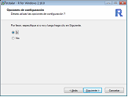
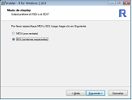
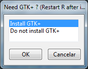

# Instalación de R

En la web del proyecto R
([www.r-project.org](http://www.r-project.org)) está disponible
mucha información sobre este entorno estadístico.

----------------------------------------   ------------------------------------
 {width="68%"}       {width="63%"}
   [R-project](https://r-project.org)       [CRAN](https://cran.r-project.org) 
----------------------------------------   ------------------------------------

Las descargas se realizan a través de la web del CRAN (The Comprehensive
R Archive Network), con múltiples mirrors:

-  *Oficina de software libre* (CIXUG) [ftp.cixug.es/CRAN](http://ftp.cixug.es/CRAN/).
-  *Spanish National Research Network (Madrid)* (RedIRIS) es
[cran.es.r-project.org](http://cran.es.r-project.org/).


## Instalación de R en Windows

Seleccionando [Download R for Windows](http://ftp.cixug.es/CRAN/bin/windows/) y posteriormente
[base](http://ftp.cixug.es/CRAN/bin/windows/base/) accedemos
al enlace con el instalador de R para Windows.

{width="40%"}
    

### Asistente de instalación

Durante el proceso de instalación la recomendación (para evitar posibles problemas) es seleccionar ventanas simples SDI en lugar de múltiples ventanas MDI (hay que *utilizar opciones de configuración*).

--------------------------------------   --------------------------------------
 {width="80%"}      {width="80%"}
 {width="80%"}      {width="80%"}
--------------------------------------   --------------------------------------

Una vez terminada la instalación, al abrir R aparece la ventana de la consola (simula una ventana de comandos de Unix) que permite ejecutar comandos de R.


### Instalación de paquetes

Después de la instalación de R, puede ser necesario instalar paquetes adicionales (puede ser recomendable ejecutar R  *como Administrador* para evitar problemas de permiso de escritura en la carpeta *library*^[Alternativamente se podrían proporcionar a los usuarios del equipo el permiso *control total* en la carpeta de instalación de R.]).

Para ejecutar los ejemplos mostrados en el libro será necesario tener instalados los siguientes paquetes:
[`dplyr`](https://dplyr.tidyverse.org) (colección [`tidyverse`](https://www.tidyverse.org/)),
[`tidyr`](https://tidyr.tidyverse.org),
[`stringr`](https://stringr.tidyverse.org),
[`readxl`](https://readxl.tidyverse.org) , 
[`openxlsx`](https://cran.r-project.org/web/packages/openxlsx/index.html), [`RODBC`](https://cran.r-project.org/web/packages/RODBC/index.html), 
[`sqldf`](https://cran.r-project.org/web/packages/sqldf/index.html),
[`RSQLite`](https://r-dbi.github.io/RSQLite), 
[`foreign`](https://cran.r-project.org/web/packages/foreign/index.html), 
[`magrittr`](https://cran.r-project.org/web/packages/magrittr/index.html),
[`rattle`](https://rattle.togaware.com),
[`knitr`](https://yihui.name/knitr) 
Por ejemplo mediante los comandos:

```r
pkgs <- c('dplyr', 'tidyr', 'stringr', 'readxl', 'openxlsx', 'magrittr', 
          'RODBC', 'sqldf', 'RSQLite', 'foreign', 'rattle', 'knitr')
# install.packages(pkgs, dependencies=TRUE)
install.packages(setdiff(pkgs, installed.packages()[,'Package']), dependencies = TRUE)
```
(puede que haya que seleccionar el repositorio de descarga, e.g. *Spain (Madrid)*).

La forma tradicional es esta:

1.  Se inicia R y se selecciona *Paquetes -> Instalar paquetes*

2.  Se selecciona el repositorio.

3.  Se selecciona el paquete y automáticamente se instala.


`Rattle` depende de la libraría gráfica GTK+, al iniciarlo por primera vez
con el comando `library(rattle)` nos pregunta si queremos instalarla:

{width="15%"}

Pulsamos OK y reiniciamos R.

---

## Instalación en Mac OS X

Instalar R de 
http://cran.es.r‐project.org/bin/macosx
siguiendo los pasos anteriores.


Para instalar `rattle` seguir estos pasos (https://zhiyzuo.github.io/installation-rattle):

1.  Instalar Homebrew:
    <https://brew.sh/>.
   
2.  Ejecutar el siguiente código en la consola:
    
    ```r
    system('brew install gtk+')
    
    local({
      if (Sys.info()[['sysname']] != 'Darwin') return()
    
      .Platform$pkgType = 'mac.binary.el-capitan'
      unlockBinding('.Platform', baseenv())
      assign('.Platform', .Platform, 'package:base')
      lockBinding('.Platform', baseenv())
    
      options(
        pkgType = 'both', 
        install.packages.compile.from.source = 'always',
        repos = 'https://macos.rbind.org'
      )
    })
    
    install.packages(c('RGtk2', 'cairoDevice', 'rattle'))
    ```

---

## Instalación (opcional) de un entorno o editor de comandos

Aunque la consola de R dispone de un editor básico de códido (script),
puede ser recomendable trabajar con un editor de comandos más cómodo y
flexible.

Un entorno de R muy recomendable es el **RStudio**,
[*http://rstudio.org*](http://rstudio.org):

{width="60%"}

Para instalarlo descargar el archivo de instalación de
[*http://rstudio.org/download/desktop*](http://rstudio.org/download/desktop).

### Opciones adicionales

Nos puede interesar modificar las opciones por defecto en RStudio, por ejemplo que los gráficos se muestren en una ventana de R o que se emplee el navegador por defecto, para ello habría que modificar (con permisos de administrador) los archivos de configuración *Tools.R* y *Options.R*
(en Windows se encuentran en la carpeta *C:\\Program Files\\RStudio\\R*). 

Para utilizar el dispositivo gráfico de R, modificar *Tools.R*:


```r
# set our graphics device as the default and cause it to be created/set
.rs.addFunction( "initGraphicsDevice", function()
{
   # options(device="RStudioGD")
   # grDevices::deviceIsInteractive("RStudioGD")
  grDevices::deviceIsInteractive()
})
```

Para utilizar el navegador del equipo en lugar del visor integrado de de R, modificar *Options.R*:


```r
# # custom browseURL implementation
# options(browser = function(url)
# {
#    .Call("rs_browseURL", url) ;
# })
```


